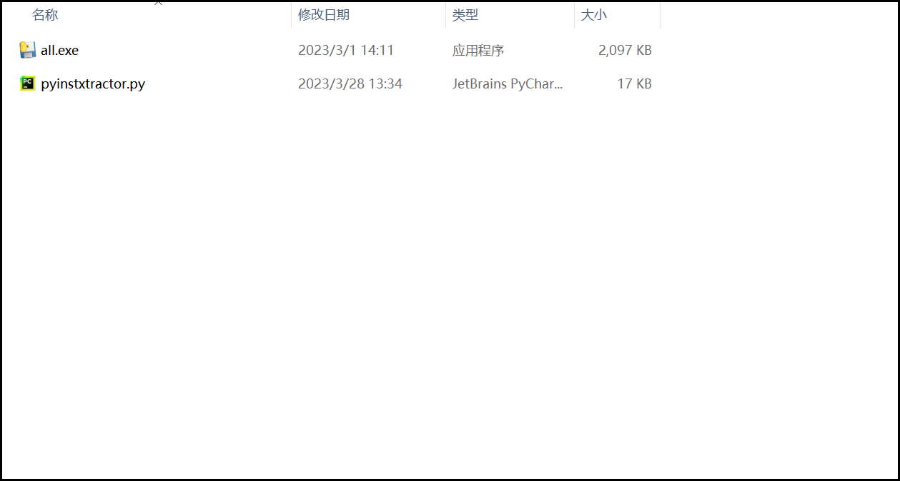
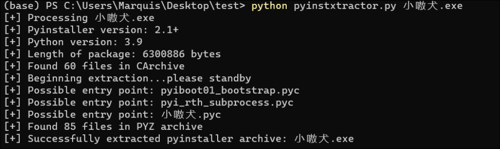
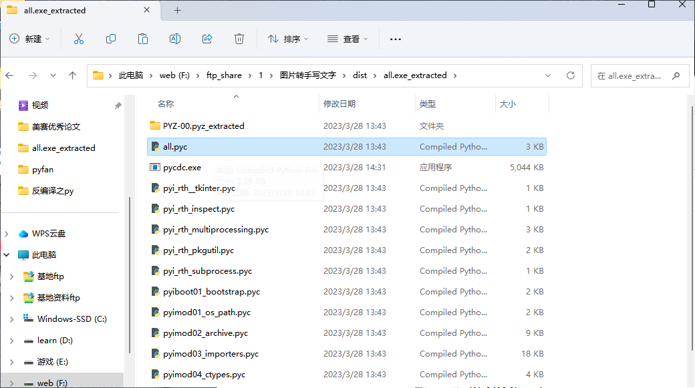
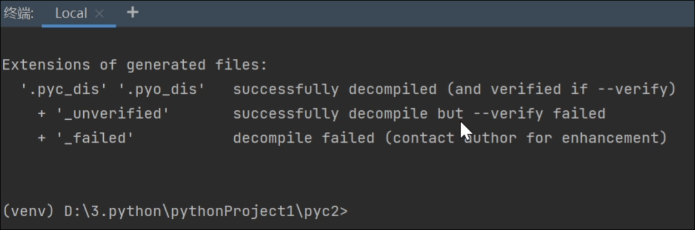
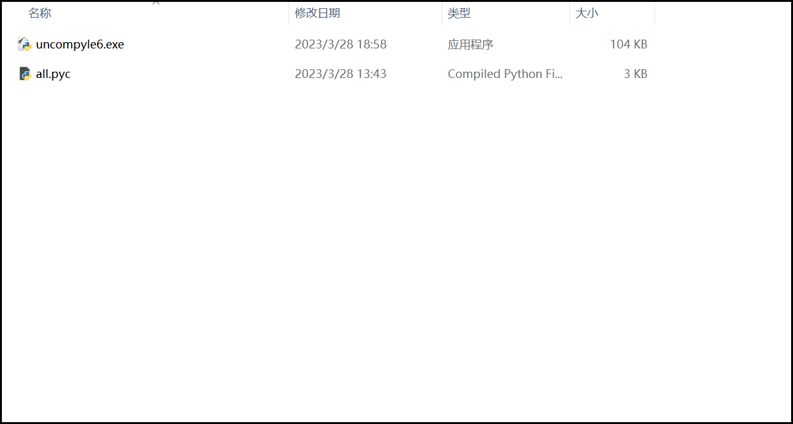

# 反编译py的.exe程序

不知道能不能兼容所有的exe（反正我的图片转手写实现不了）


## 转为.pyc过程：

步骤一：下载pyinstxtractor.py，并放到要反编译的.exe同一个目录下，如下图所示：



接着在当前目录打开终端，输入``` python pyinstxtractor.py 文件名.exe```

正常结果如下：(图我盗的，差不多就这个意思)



接下来会在当前目录中生成一个文件夹

点进去文件夹，会看到几个带有.pyc的文件，需要的就是和你文件同名的pyc




## pyc的含义：

​	对于Python编译器来说，PyCodeObject对象是其真正的编译结果，PyCodeObject对象保存在内存中。在程序运行结束时，会根据规则决定是否将PyCodeObject对象写回硬盘，如果写回硬盘，就会生成pyc文件，所以，pyc文件只是这个PyCodeObject对象在硬盘上的表现形式。

​	pyc文件是由.py文件经过编译后生成的字节码文件，其**加载速度相对于之前的.py文件有所提高**，而且还可以**实现源码隐藏**，以及**一定程度上的反编译**。因此，不同版本的python可能运行不了同一个pyc文件。


## 将pyc文件转为.py

两种办法：

- 在线转化

​		没啥好说的了，直接上链接，但是支持的python版本很低，貌似才到3.6

``` https://tool.lu/pyc/```          [转pyc网址]([python反编译 - 在线工具 (tool.lu)](https://tool.lu/pyc/))

- 利用uncompyle6

  环境：pycharm

  首先创建虚拟环境，接着用pip下载uncompyle6

  下载结束后，可以在终端中用这行代码查看是否下载成功

  ``` uncompyle6```

  成功后的截图如下所示：

  


如果出现了如下图情况


那么恭喜你，出大问题拉！

##### 解决步骤：

1. 尝试创建虚拟环境（我就是这么干的）
2. 直接从自己的python库中把uncompyle6拖出来（两个），因为主要需要的是里面的.exe，而不是这个库


如果在没有红字的情况下，直接通过pycharm左边的标题查找下载的路径，并将uncompyle6.exe拖入到.pyc相同的目录中。

如下图所示：




## 接下来，就是最后一步！

编写.bat文件

tip：可以先创建txt文件，复制粘贴代码后将后缀改为.bat，名字可以自己随便取

代码如下：

```
@echo off
C:			# 你的路径位置
cd C:\Users\Lenovo\Desktop\pyfan	# 你的主路径位置
set path=%~dp1
start uncompyle6.exe -o %path%\. %1
pause
```

除了注释以外，其他可以不需要动（因为我自己也看不懂==）


接着

win+R，输入```shell:SendTo```

将bat文件放进去，如下图所示：


## 结束！接下来是演示成果

点击想要反编译的.pyc，右键发送到 自己取的文件名.bat，同级目录下就会出现py文件

*图片懒的搞了，最后一步相信大家肯定能自己搞出来


### 需要的东西都上传了。。。就当作是自己的第一次练习经历把

参考博客：[(40条消息) Python 反编译：pyinstxtractor工具和uncompyle6库的使用_小嗷犬的博客-CSDN博客](https://blog.csdn.net/qq_63585949/article/details/126706526)

